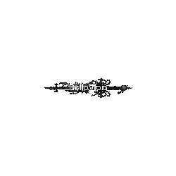

 

 

<h1>Zellavian</h1>

Zellavian is a GitHub language statistics card generator built with Node.js, designed with unique visual styles inspired by gothic aesthetics, cybersigilism, and pixel-art.
Unlike typical tools, Zellavian analyzes programming languages using actual byte-level usage from the GitHub API, producing accurate percentage-based insights across all your repositories — including private repositories when using a token.

